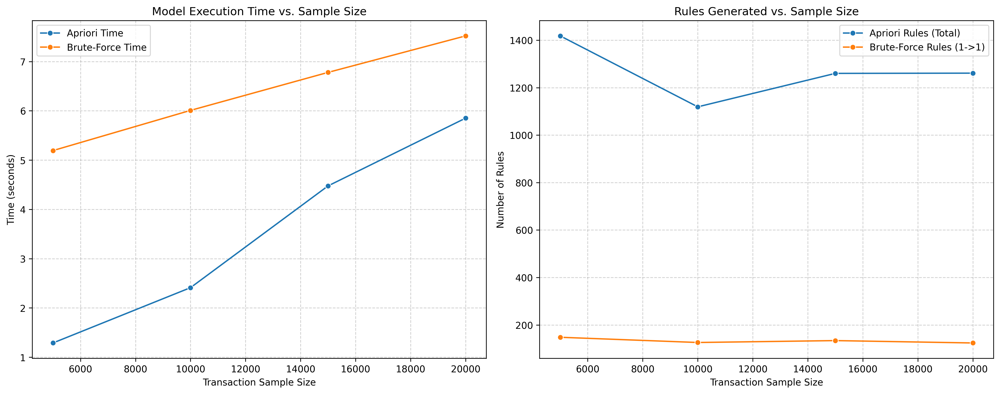

# Market Basket Association Rule Mining — Apriori vs Brute-Force

> **Course**: IN6227 Data Mining · Nanyang Technological University (NTU)  
> **Author**: Gerry Julian (G2507395K)  
> **Assignment**: Assignment 2 — Association Rule Mining Model Comparison

---

## 📌 Overview

This project implements and benchmarks two **Association Rule Mining (ARM)** algorithms on a real-world retail market basket dataset:

| Algorithm | Description |
|-----------|-------------|
| **Apriori** | Classic lattice-based frequent itemset mining via `mlxtend` |
| **Brute-Force** | Exhaustive pairwise itemset enumeration (size-2 only) |

The study evaluates both algorithms across **four transaction-scale samples** (5K–20K) to quantify their **scalability**, **execution time**, and **rule generation quality** — ultimately producing actionable business recommendations from the strongest discovered rules.

---

## 📁 Project Structure

```
├── notebooks/
│   └── 01_association_rule_mining.ipynb   # Full pipeline: EDA → preprocessing → modeling → comparison
│
├── data/
│   ├── raw/                               # Original unmodified source files
│   │   ├── market_basket.csv              # Primary dataset (semicolon-delimited)
│   │   ├── market_basket.xlsx             # Excel version of primary dataset
│   │   ├── market_basket_full.csv         # Complete unsampled data
│   │   └── market_basket_backup.csv       # Auto-generated backup
│   └── processed/                         # Sampled subsets for scalability testing
│       ├── market_basket_5000.csv
│       ├── market_basket_10000.csv
│       ├── market_basket_15000.csv
│       └── market_basket_20000.csv
│
├── results/
│   ├── figures/
│   │   └── scalability_comparison.png     # Time & rule-count chart across sample sizes
│   └── reports/
│       ├── comparison_results.csv         # Apriori vs Brute-Force benchmark table
│       └── final_rules_apriori.csv        # Top association rules (with full metrics)
│
├── src/                                   # (Reserved) Standalone Python modules / scripts
├── docs/                                  # Additional documentation
│   └── METHODOLOGY.md
│
├── .gitignore
├── requirements.txt
└── README.md
```

---

## 🔬 Methodology

### Dataset
- **Source**: Retail market basket transaction records
- **Columns**: `BillNo`, `Itemname`, `Quantity`, `Date`, `Price`, `CustomerID`, `Country`
- **Delimiter**: Semicolon (`;`)
- **Unique Items**: 250 (after text normalization)

### Pipeline

1. **Data Loading & Backup** — load from CSV, create safety backup
2. **Cleaning** — drop duplicates, handle missing `Itemname`, text normalization (lowercase, strip, remove special chars)
3. **Exploration** — top-20 item frequency analysis
4. **Preprocessing** — stratified transaction sampling at 5K / 10K / 15K / 20K
5. **Modeling** — apply Apriori & Brute-Force across all sample sizes
6. **Comparison** — benchmark execution time and number of rules generated
7. **Business Insights** — extract top rules by lift & confidence

### Parameters

| Parameter | Value |
|-----------|-------|
| Min Support | `0.01` |
| Min Confidence | `0.5` |
| Metric | `confidence` |
| Actionable Lift | `≥ 1.2` |
| Actionable Confidence | `≥ 0.6` |
| Top Items per Sample | `250` |

---

## 📊 Key Results

### Scalability Benchmark

| Sample Size | Apriori Time (s) | Apriori Rules | Brute-Force Time (s) | Brute-Force Rules |
|-------------|-----------------|---------------|---------------------|-------------------|
| 5,000       | 1.29            | 1,418         | 5.19                | 148               |
| 10,000      | 2.41            | 1,119         | 6.01                | 126               |
| 15,000      | 4.48            | 1,260         | 6.78                | 134               |
| 20,000      | 5.85            | 1,261         | 7.52                | 124               |

### Findings
- **Apriori** consistently outperforms Brute-Force in speed (~2–4× faster) while generating **significantly more rules** (9–11× more), demonstrating the power of the pruning strategy.
- **Brute-Force** scales less gracefully due to O(n²) pairwise enumeration with no pruning.
- Rule count stabilises for Apriori beyond 10K transactions, suggesting sufficient dataset coverage.

---

## 🚀 Getting Started

### Prerequisites
- Python 3.8+
- Jupyter Notebook / JupyterLab

### Installation

```bash
# 1. Clone the repository
git clone https://github.com/GerryJulian/IN6227_Data-Mining_Assignment-2.git
cd IN6227_Data-Mining_Assignment-2

# 2. Install dependencies
pip install -r requirements.txt

# 3. Launch the notebook
jupyter notebook notebooks/01_association_rule_mining.ipynb
```

---

## 🛠️ Dependencies

| Library | Purpose |
|---------|---------|
| `pandas` | Data manipulation |
| `numpy` | Numerical operations |
| `mlxtend` | Apriori & association rule mining |
| `matplotlib` | Plotting |
| `seaborn` | Statistical visualisation |

---

## 📈 Results Preview



---

## 📄 License

This project is submitted as academic coursework for **IN6227 Data Mining** at NTU. All rights reserved by the author.

---

## 👤 Author

**Gerry Julian** · G2507395K  
Nanyang Technological University — Wee Kim wee School of Communication and Information
